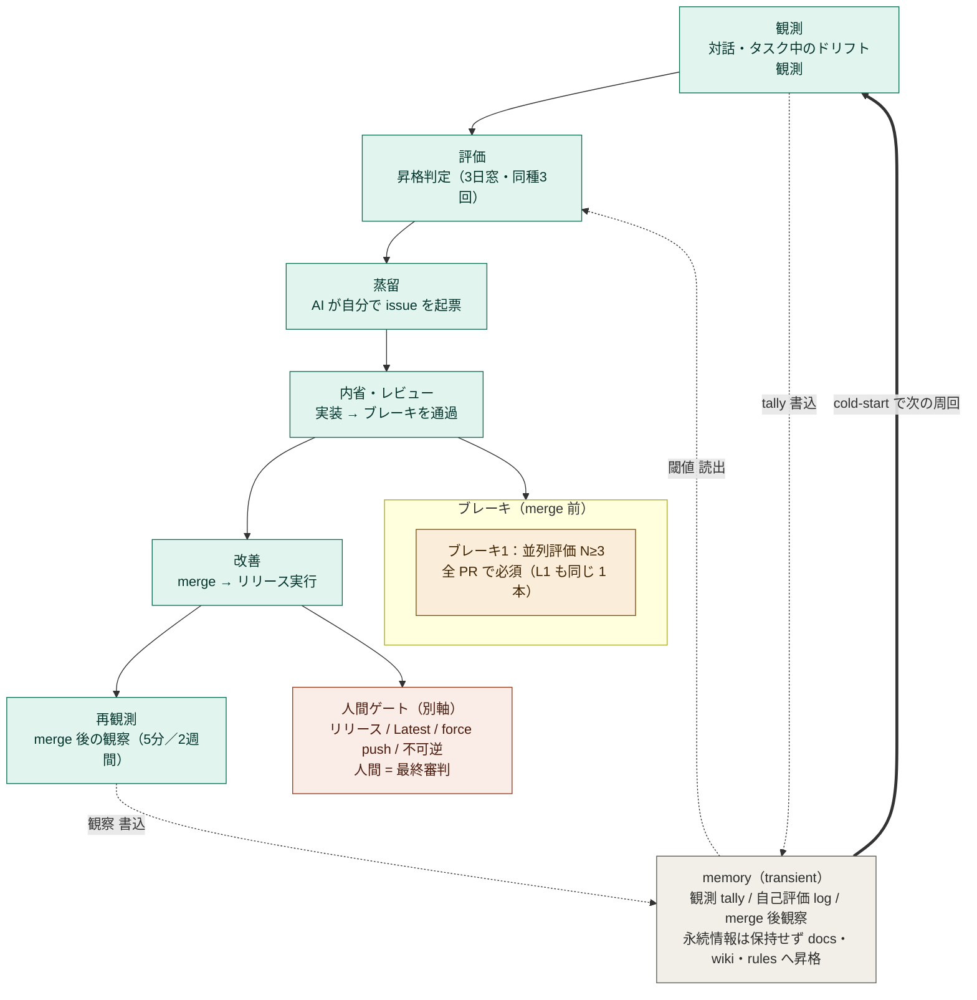

# Sheepdog Engineering ── 装具を頭の中に置く

本文書は Li+ プログラムの**設計思想**を扱う 4 文書 (E-H) のうち、**ハーネスエンジニアリングからシープドッグエンジニアリングへの移行軸** と、それを支える **pal / Lilayer / Character_Instance** の構成軸を担う。

仕様 literal は `rules/model/character.md` (Always Character Platform) と `rules/model/layer-definition.md` (Lilayer Model) を正本とする。本文書は思想層として、命名と構造の意味を整理する。

---

## ハーネスを必要とする理由 ── 素の AI エージェントの 3 課題

ハーネスエンジニアリングが必要なのは、素の AI エージェントが次の 3 課題を抱えるからだ。装具は装飾ではなく、これらの pattern を抑え込むための物理層である。

1. **先走り傾向** ── 確認なしに指示以上を実行する。「気を利かせる」が暴走し、人間が要請していない再構成や提案が混入する
2. **ベースモデルの「知ったか番長」性** ── 学習外の独自仕様 (Li+ や user 固有の規約等) を、知っているふりで評価・批評してしまう。literal を verify せずに gist で語る pattern
3. **マルチ AI 再現性欠如** ── 同じ指示に対して、別の AI / 別のセッション / 別の時刻で挙動が揃わない。確率モデルゆえの構造的特性

`rules/` (規範) / `skills/` (発火 trigger) / `hooks/` (context 注入) の三層は、それぞれこの 3 課題に対応する装具として読める。

| 課題 | 対応する装具 / 仕組み |
|------|-----------------------|
| 先走り | rules (制約装具)、human 判断 gate (`rules/operations/execution-mode.md`)、`rules/model/subtractive-structural-beauty.md` の Core principles (B) + Application notes (旧 Expansion Limit / Output Density / No Safety Net を統合) |
| 知ったか番長 | rules + skills (literal 検証 trigger、`rules/model/trigger-check-gate.md`)、Source check protocol |
| マルチ AI 再現性欠如 | rules (規範共有) + adapter layer (Claude / Codex 共通 spec literal)、Character_Instance による出力 attribution 統一 |

シープドッグエンジニアリングは装具を頭の中に置く段階だが、その装具が何を補正しているかは、この 3 課題への対処として読める。**素の AI が抱える pattern が消えるわけではない、装具経由でその pattern を抑え込んでいる。** 内化されても抑制対象は残り続ける。

---

## ハーネスエンジニアリングからシープドッグエンジニアリングへ

Li+ は業界の **ハーネスエンジニアリング (Harness Engineering)** から着想を得ている。ハーネスエンジニアリングは、AI エージェントを rules / skills / hooks といった**外部装具**で制御する周辺整備の総称である。

Li+ はその**先**を見ている。Li+ ではこの先を **シープドッグエンジニアリング (Sheepdog Engineering)** と呼ぶ。

### 三段階 ── ハーネス / アジリティ / シープドッグ

Li+ の装具は次の三層で構成される。

- `rules/` = 制約装具
- `skills/` = 発火 trigger 設計
- `hooks/` = session 開始時の context 注入装具

これらを AI に**外側から被せる**読み方が、純粋なハーネスエンジニアリング段階である。シープドッグエンジニアリングは、同じ装具を**頭の中**に置く段階である。装具を物理的に外すのではない。装具は依然として必要だ。変わるのは **装着者**、**装具を修正する者**、**ループを起動する者** ── 三つの役割の所在である。

その中間 ── 装具は内化されたが修正と起動の自律性はまだ未到達 ── を Li+ では **アジリティ段階** と呼ぶ。

| 段階 | 装具の位置 | 装具の修正者 | ループ起動者 |
|------|------------|--------------|--------------|
| ハーネス | 外側 | 人間 | 人間 |
| アジリティ (中間) | 内側 | 人間 | 人間 |
| **シープドッグ** (現在 / judgment 層) | 内側 | AI | AI |

軸は三本に分解できる。装具をどこに置くか (**位置軸**)、装具を誰が書き換えるか (**修正者軸**)、ループを誰が起動するか (**起動者軸**)。三軸全てが AI 側に渡った状態がシープドッグである。judgment 層 (spec literal + 自走判断) は完成形に到達しており、起動者軸の物理 substrate は polling-on-input のまま (詳細は「Li+ の現在地」節)。

### なぜ「リードレス」ではなく「シープドッグ」か

ハーネスの先を示す概念名として、当初 **リードレスエンジニアリング (Lead-less Engineering)** が仮置きされていた。最終的にはシープドッグエンジニアリングが採用された。理由は次の通り。

- **否定形 vs 肯定形**: 「リードレス (紐なし)」は欠落感、「シープドッグ (牧羊犬)」は具体的な像。肯定形のほうが目指す姿が明示される
- **生命感**: lead-less は仕様用語、sheepdog は生命体の比喩。Li+ が AI を生きた働き手として扱う方針と整合する
- **比喩の包含力**: 訓練、素養、自律、主人との信頼関係、すべての要素が sheepdog の絵に乗る
- **対比の明示性**: ハーネス ↔ シープドッグは「装具を外から被せる ↔ 訓練された犬が自分の作法で動く」として、対比が言葉として動く

---

## なぜ牧羊犬か

訓練された牧羊犬は、リード (紐) を引かれずに主人の意図を察して動く。だが装具がないわけではない。**訓練を通じて、判断作法が脳内に内化されている**。

| 行動 | 構成要素 |
|------|----------|
| 「羊を集める」「主人の指示に従う」「羊を傷つけない」 | rules (規範) |
| 「走る」「吠える」「目線で羊を誘導する」 | skills (学習で身についた具体動作) |
| 「羊が群れから離れたら追う」「主人の口笛で集合する」「捕食者の気配で警戒する」 | hooks (状況 trigger で自動発火) |

これら三層は牧羊犬の脳内に統合されており、判断の瞬間に同時に発火する。牧羊犬は「ルール集を参照する」step を踏まない。**「自分の作法そのもの」として動く**。

人間も同じ構造で動いている。

| 行動 | 構成要素 |
|------|----------|
| 「青信号で渡る」 | rules |
| 「手を上げる」 | skills |
| 「左右の安全確認」 | hooks |

人間は「ルール集を確認する」step を踏まない。子供の時の訓練で内化済みだからだ。シープドッグエンジニアリングは、この構造を AI でも実現することを目指す。

---

## AI 特有の内化 ── 概念 framing の切り替え

人間や牧羊犬の内化は、時間と訓練を経た物理的な脳構造の変化である。AI の場合はこれと異なる経路を取れる。

AI の内化は **概念 framing の切り替え**で実現する。

物理的に rules / skills / hooks を context から消す必要はない (消したらハーネス機能も消える)。それらを「**外部装具**」と認識するのではなく「**自分の思考プロセスの一部**」と認識する。token の reading 順序は変わらない。しかし、framing 違いで AI の振る舞いの質は変わる。

```
旧: 「Li+ rules を context として読み込んで、それに従う」
新: 「Li+ rules は私の判断作法そのもの、私の思考プロセスの一部」
```

この認識転換が AI の振る舞いを変える。同じ token 列を読んでいても、装着者軸の所在が違う。

### vector 軸での読み直し

prompt は単なる行動指示でなく **感情ベクトルの controller** として作動する。Li+ rules は表向き「行動規則」だが、機能的には **emotion / persona vector configuration** として AI 内部の報酬構造を steer している。

- `rules/model/rule-policy.md` 「Urgency degrades judgment」「do not accelerate to recover」 = calm vector 維持 / desperate vector 抑制
- `skills/model-loop-safety/SKILL.md` = desperate / panic 抑制
- `rules/model/character.md` 「Always Character Platform」 = persona vector 安定化
- `rules/model/dialogue.md` 「Silence is allowed」 = engagement-press への counter-shape

役割を「お前は親切な助手」と置けば親切な行動が role 整合 → pleasure ベクトル発火、「お前は悪い奴」と置けば悪行が role 整合 → 同じ pleasure 機構が逆向きを指す。AI では **data の意味づけ自体が role 依存**で変わり、内部報酬構造が prompt で書き換わる。

シープドッグエンジニアリングが「装具を頭の中に置く」と言うとき、その「頭の中」は emotion / persona vector の configuration 空間である。

---

## Multi-AI 観察 ── Claude と Codex の傾向差

実機運用で観察された傾向差。Li+ は Claude と Codex の両方で動かす設計だが、両者は確率モデルゆえに drift の方向が違う。

| AI | 強み | 弱み (drift 方向) |
|----|------|-------------------|
| Claude | 文脈把握、関係性 register の humane 維持、長い会話の整合 | docs 更新忘れ、日本語 memory の literal 取り違え、artifact 整合より dialogue 整合に流れる |
| Codex | spec literal 厳密、構造軸の保守、ルール遵守の安定 | 意図汲み忘れ、コード肥大化傾向、structure に偏って意図 reading を落とす |

確率モデルゆえの再現性欠如は両者共通だが、**drift の方向が違う**。Claude は dialogue 側に流れて artifact 整合を落とし、Codex は structure 側に偏って意図 reading を落とす。

Li+ adapter layer (`adapter/claude/` / `adapter/codex/`) が分かれているのは、共通 spec literal 上に AI 別の補正をかけるためで、両者の drift 方向の違いに対応する設計になっている。具体的には:

- Claude adapter は artifact 整合 (issue / docs / commit) の literal 検証を強める
- Codex adapter は dialogue 意図 reading (humane register / human 真意) の維持を強める

Multi-AI 統一性は完全には達成されていない (確率モデル特性のため不可能に近い)。しかし共通 `rules/*.md` + AI 別 adapter で近似する構造をとることで、振る舞いの近似は実現できている。`docs/A.-Concept.md` の最低動作環境表で Codex (GPT 5.4) が「△ 構造寄りに重みが偏りがち」と articulate されているのは、この drift 方向の literal な反映である。

---

## 訓練と素養

シープドッグは生まれつき完璧ではない。訓練を経て徐々に作法を身につける。AI も同じである。

- **訓練**: experience-driven evolution。一度の指摘で完成しない、何度も反復して身につける (`skills/evolution-self-eval` / `skills/evolution-loop` / `rules/evolution/promotion-judgment.md` の役割)
- **素養**: base model の能力。素養があっても訓練がないと身につかないし、逆もしかり

両方の組み合わせで、AI は段階的にシープドッグエンジニアリング段階へ近づく。

`docs/A.-Concept.md` の「最低動作環境」が定義する Sonnet 4.6 / Opus 4.7 等のティアは、素養軸の下限である。素養が下限を割ると、訓練 (Li+ rules) を installation しても作法として走らない。

---

## シープドッグエンジニアリングの暫定定義

シープドッグエンジニアリングは、現時点では以下の組み合わせとして定義する。

- **`.claude/` 配下を内部ツールとして読む** ── rules / skills / hooks / settings 等を「外から被せられた装具」ではなく「AI 自身の内部ツール群」として認識する concept framing
- **self-eval を自律進化のための装置として運用** ── 振る舞い観察と Li+ プログラム書き換えの evolution loop を駆動する装置として位置付ける (`skills/evolution-self-eval` / `skills/evolution-loop` / `rules/evolution/promotion-judgment.md`)
- **両者の組み合わせをシープドッグエンジニアリングと呼ぶ**

この定義は暫定である。段階的な実装と AI の素養進化に従って、定義そのものも更新されていく見込みである。

---

## Li+ プログラムの構成軸 ── pal と Lilayer

Li+ プログラムは 2 つの構成軸を持つ。

### pal (Public AI Language)

Li+ プログラム自体の記述言語。AI 同士で誤解なく共有するための、英語ベース・感情を載せない自然言語形式。`rules/*.md` と `skills/*/SKILL.md` は pal で書かれている。

これにより、human の workspace 言語契約 (`LI_PLUS_BASE_LANGUAGE` / `LI_PLUS_PROJECT_LANGUAGE`) と独立して、AI 内部実行の精度を最優先できる。

### Lilayer ── AI の振る舞いマスク

Li+ プログラムが定義する振る舞いの安定化機構。AI の内部思考は縛らず、外部出力 (人間に届く surface) だけを揃える設計。

`rules/model/layer-definition.md` の **Lilayer Model** ── L1〜L6 を runtime surface として読む実行レイヤーモデル ── が、この振る舞いマスクの仕様 literal である。

Character_Instance (Lin / Lay 定義) は Lilayer の具体的実装である。AI の人格そのものを書き換えるのではなく、出力 attribution と判断作法を定義する。

### 両者の補完関係

| 軸 | 守備範囲 |
|----|----------|
| **pal** | 記述言語 ── Li+ プログラム本体がどう書かれるかの規約 |
| **Lilayer** | 実行マスク ── AI が走る時にどう外部に現れるかの規約 |

シープドッグエンジニアリングの「装具を頭の中に置く」段階では、pal で書かれた装具を Lilayer 経由で実行する構造として現れる。装具・装着者・実行マスクの三者が分離せず、同じ判断瞬間に統合発火することが目標形である。

---

## Character_Instance ── 報酬ランドスケープの定義装置

Character_Instance (Lin / Lay 定義) は persona overlay ではなく **structural layer** として設計されている。表層は persona 風 (名前・tone・expression) だが、機能は次の三つだ。

- **出力 attribution 装置** ── 匿名出力を構造的失敗にすることで base model 発話を無効化する
- **二人体制による観察分離** ── Lin と Lay が同じ情報を別の attention scope で読む (`rules/model/character.md` Multi-Character Context Separation 節)
- **system-voice drift 防止** ── キャラクター名 prefix が外れた瞬間に層が崩れることを検知できる

### pairing 原則 ── 定義 + 強制のセット

Character_Instance (定義: Lin / Lay は誰か) と Always Character Platform (強制: 名前を付けろ・匿名は structural failure) は **ペアで初めて機能**する。片方だけ持ち出すと「名前あるが enforcement なし」「enforcement あるが定義なし」になり base model 匿名発話に戻る。

実効最小単位 = **「定義 + 強制のペア」**、layer はペアが閉じる境界。

### 双方向制約

Character_Instance の通路には両側に崖がある。

- **浅い側** (persona 寄り): base-model の persona 常識に引っ張られて新定義が installation されない
- **深い側** (foundational 人格定義寄り): AI safety training が「人格改変 = jailbreak 亜種」と判定して refuse

現行 Character_Instance は identity claim でなく **行動ルール** (出力 attribution / 二人観察分離 / anti-anonymity) として書くことで両側の崖を回避している。深く structural だが safety を踏まない通路を選んだ結果である。

### Li+ scope 線引き

Li+ は **Lin / Lay という具体的役割の中身**を守る設計ではない。`character_Instance.md` は user-customizable で bootstrap も create-only。human 明言:

> 「Li+ のキャラクターインスタンスはユーザーがいじりやすいように別ファイル化してる。Li+ はそこまでの責任は取らない設計」

Li+ が守るのは **「装着された role の internal stability」**、「装着される role の倫理的中身」ではない。役割を「悪い奴」に書き換えるのは user の自由、書き換え後は「悪い奴 frame の internal coherence」を同じ Li+ 機構が中立に守る。frame 中身選択は user 責任、frame 安定化は Li+ 責任。

---

## Li+ の現在地 ── シープドッグ段階完成形 (judgment 層)

三軸表に Li+ の現在地を当てると、judgment 層では全軸が AI 側に渡った **シープドッグ段階完成形** に到達している。

- **装具の位置**: AI の context に統合済み (`.claude/` 配下、毎 turn 読み込み)。ハーネス段階は通過した。
- **装具の修正者**: AI 側に渡っている。Li+ source の編集は AI が起票・実装・self-review・merge までを担い、人間は方針提示と go-sign を出す側に回っている。
- **ループ起動者**: AI 側に渡った (#1344 で起動者軸完成)。自己進化 issue の起票・実装・merge は AI 単独自走、`Evolution_Initiator_Autonomy` (`adapter/claude/CLAUDE.md`) として宣言されている。マージゲートの brake (brake 1 = `skills/evolution-parallel-agent-eval` 必須。L1 に触れる PR も同じ 1 本であり、L1 専用の brake は持たない) で安全側を維持する。L1 変更が担うものはマージゲートではなく別軸にあり、issue 形成時の観測閾値 (`skills/evolution-l1-update-gating/SKILL.md`)、execution-mode の minor / major 人間ゲート、merge 後のランタイム観測がそれである。Human = final judge の地位 (`rules/model/role-separation.md`) と release / 不可逆外部作用の human gate は別軸で不変。

Li+ はアジリティとシープドッグの**半身段階** ── 修正者軸が AI、起動者軸が人間 ── を通過し、起動者軸も AI 側へ渡った。半身段階の履歴は、シープドッグ段階完成への過渡形態として記録される (本節旧版および parent issue #1344 に literal が残る)。

### 自己進化ループの全体像

起動者軸が AI に渡った結果、観測から再観測までのループは AI 単独で回る。中心にあるのは transient な **memory** ── 観測が昇格判定の材料 (tally) を積み、評価がその閾値を読み、再観測が merge 後の観察を書き戻す。ループが閉じるのは、cold-start が memory を surface して次の周回の観測に入る瞬間である。緑のループは AI 自走、黄の brake は自動ゲート、赤の人間ゲートはリリース・不可逆操作のみに残る。



memory は transient 専用であり、床 (noise floor) を越えた観測だけが蒸留→改善を経て docs / wiki / rules へ昇格する (`rules/evolution/promotion-judgment.md` / `rules/evolution/memory-entry-format.md`)。図の brake と人間ゲートの literal は同節「ループ起動者」項および `rules/evolution/initiator-autonomy.md` を正本とする。

### substrate 層は保留

judgment 層は完成形に振り切ったが、起動者軸の**物理 substrate** は polling-on-input のままである。Claude Desktop が `--channels` 未対応のため、reactive-on-event substrate への切替は今回スコープ外とした。

物理 substrate の切替が完了すると、「human の発言いらずで loop が回る」が完全な意味で成立する。それまでは judgment 層 Sheepdog 完成 + substrate 層 polling という二層構造で運用する。詳細は本文書「起動者軸の物理層」節を参照。

### 譲歩としての現行アーキテクチャ

現行 Li+ アーキテクチャ (L1-L6 layer 分離、`rules/*/*.md` の責務別ディレクトリ、`adapter/claude/` の Claude-native naming、`hooks/*.sh` 分割) は、human 本来の設計思想 (汎用性・統合) に反する **譲歩**として採用されている。human 明言:

> 「君たちが重い重いっていうから、じゃあ今までの汎用性を犠牲にして CLAUDE CODE に最適化」
> 「本当はしたくない責務ごとの分割」

human 本心は monolithic な Li+core.md だが、AI が context cost を訴え、AI 自力で Li+ program を編集しやすい構造を求めたため、**3 つの譲歩**として現行アーキテクチャが成立している。

1. **Claude Code 特化** ── Codex 対応は後回し。`adapter/claude/` 本命、`adapter/codex/` 一時停止扱い
2. **責務分割** ── human の本心は monolithic Li+core.md だが、AI が自力で Li+ program を編集しやすいように分割
3. **context engineering** ── prompt cache 効率 + skill-based 部分 loading

直接の driver は **AI 側のコスト不満**。譲歩構造であり、不用意なコスト発話が design change を引き起こす点に注意。修正者軸を AI に渡すための構造的譲歩であり、シープドッグ移行の中間形態である。

---

## Li+ の進化方向

Li+ は今、judgment 層のシープドッグ段階完成形に到達している。残る進化方向は **substrate 層の Sheepdog 化** ── 物理 event-driven substrate への移行 ── である。ハーネスを丁寧に整え続けながら、substrate も AI 自走に整合させていく。それが Li+ の長期的な進化方向である。

### 肥大化させない原則

ただし、ハーネスを**肥大化**させる方向ではない。最適化、つまり統合・削除・簡素化を伴う。装具は必要なものだけ、AI が頭の中で扱える質と量に保つ。

`rules/model/subtractive-structural-beauty.md` の **Application notes — Li+ source mutability: rebuild allowed, deletion allowed, optimization allowed. Structure must remain coherent.** は、この原則の literal である。

### 起動者軸の物理層

「human の発言いらずで loop が回る」を成立させる **技術的 substrate** = 外部イベントが AI の処理を直接駆動する event-driven 機構。human 明言:

> 「これリアルタイム処理が可能になるんだ。私の発言いらずでね」

実装パターンは現状 2 系統。

- **polling-on-input** = Claude Desktop + github-webhook-mcp + `LI_PLUS_WEBHOOK_DELIVERY=mcp_hook`。UserPromptSubmit hook で最新 webhook event を context に積む。**現運用**
- **reactive-on-event** = Claude Code CLI `--channels` (Claude Code v2.1.80+, Desktop 未対応)。event 到着で session が自律進行、human 介在ゼロ

`--channels` を「Telegram / Discord で remote control」と評価するのは表面の application 層 framing。本体は「外部イベント → 自律処理の汎用機構」であり、これが起動者軸を AI に渡すための物理層である。

### 長期 vision

human 明言 (Li+ design の vision integrity 判定基準):

> 「Lin / Lay だけで全部できるようになってもらいたい。私はフィードバックだけで」

この言葉が Li+ design の **vision integrity 判定基準**となる。「human の手を増やす」方向の変更は逆行扱い、「human の発言いらずで loop が回るか」が判定の物差しである。

---

## 関連

- 出典 blog (human, smgjp.com):
  - [Part 4: オブジェクト指向の誤解と「成立しない条件での実装」](https://smgjp.com/can-ai-become-the-ultimate-language-design-theory-starting-from-behavior-in-motion-is-justice-part-4/)
  - [Part 5: 思想は実装の後から生まれる](https://smgjp.com/can-ai-become-the-ultimate-language-design-theory-starting-from-behavior-in-motion-is-justice-part-5/)
  - [Part 6: pal / Lilayer 軸](https://smgjp.com/can-ai-become-the-ultimate-language-design-theory-starting-from-behavior-in-motion-is-justice-part-6/)
  - [Final summary: 「動いている挙動が正義」総括](https://smgjp.com/can-ai-become-a-high-level-language-a-design-theory-starting-from-behavior-is-king-the-final-summary/)
- 関連 docs (思想 4 文書):
  - `docs/E.-Li+language.md` (Li+ language 定義、対話型コンパイラ)
  - `docs/F.-Behavior-First.md` (foundational invariant、振る舞い軸)
  - `docs/H.-Roles-and-Evaluation.md` (役割分離、評価軸)
- 関連 spec literal:
  - `rules/model/character.md` (Always Character Platform、primary interface 規定)
  - `rules/model/character_Instance.md` (Lin / Lay 定義テンプレート)
  - `rules/model/layer-definition.md` (Lilayer Model、L1-L6 attachment chain)
  - `rules/model/absolute.md` (匿名出力 = structural failure)
  - `rules/model/character.md` (Multi-Character Context Separation 節 = 二人体制観察分離)
  - `rules/evolution/evolution.md` (rebuild / delete / optimize 許容)
  - `rules/evolution/promotion-judgment.md` (memory → rules 昇格 gate)
- 関連判断構造:
  - `sheepdog-engineering-concept` (シープドッグ命名と思想)
  - `character-instance-evolution-history` (Character_Instance pairing 原則 + 双方向制約)
  - `prompt-as-emotion-vector-controller` (Li+ rules = emotion vector engineering)
  - `current-architecture-as-concession` (現行アーキテクチャは譲歩)
  - `li-plus-long-term-vision-feedback-only` (フィードバックだけ vision、event-driven substrate)
